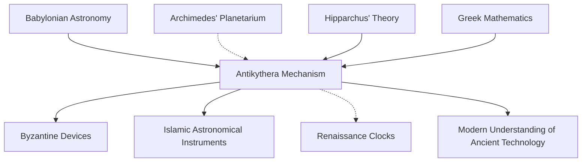

# Knowledge Graph: Antikythera Mechanism

## Core Entity
**Antikythera Mechanism**
- Type: Ancient Greek Analog Computer
- Period: ~100 BCE
- Discovery: 1901
- Location: Antikythera shipwreck, Greece

## Key Relationships

### Discovery & History
```
Antikythera Mechanism
  ├─ DISCOVERED_IN → Antikythera Shipwreck (1901)
  │   ├─ LOCATED_AT → Between Kythera and Antikythera islands
  │   └─ DISCOVERED_BY → Greek sponge divers
  │
  ├─ STUDIED_BY → Valerios Stais (1902, first recognition)
  ├─ ANALYZED_BY → Derek de Solla Price (1950s-1970s)
  ├─ RESEARCHED_BY → Antikythera Mechanism Research Project (2005+)
  └─ HOUSED_IN → National Archaeological Museum, Athens
```

### Physical Properties
```
Antikythera Mechanism
  ├─ MADE_OF → Bronze
  ├─ ORIGINAL_SIZE → Shoebox-sized wooden case
  ├─ CONTAINS → 30+ bronze gears (originally ~37)
  ├─ HAS_COMPONENT → Front dial
  ├─ HAS_COMPONENT → Back dials (upper & lower spirals)
  └─ HAS_FEATURE → Inscribed text (3,500+ characters)
```

### Functions & Capabilities
```
Antikythera Mechanism
  ├─ PREDICTS → Solar eclipses
  ├─ PREDICTS → Lunar eclipses
  ├─ CALCULATES → Moon phases
  ├─ TRACKS → Sun position (zodiac)
  ├─ TRACKS → Moon position
  ├─ TRACKS → Planet positions (Mercury, Venus, Mars, Jupiter, Saturn)
  ├─ MODELS → Lunar anomaly (Moon's variable motion)
  ├─ DISPLAYS → Olympic Games cycle
  └─ USES → Metonic cycle (19-year calendar)
```

### Astronomical Concepts
```
Antikythera Mechanism
  ├─ IMPLEMENTS → Saros cycle (223-month eclipse prediction)
  ├─ IMPLEMENTS → Exeligmos cycle (3 Saros = 54 years)
  ├─ IMPLEMENTS → Callippic cycle (4 Metonic = 76 years)
  ├─ USES → Epicyclic gearing (for planetary motion)
  └─ INCORPORATES → Babylonian arithmetic
```

### Historical Context
```
Antikythera Mechanism
  ├─ CONTEMPORARY_WITH → Hellenistic period
  ├─ INFLUENCED_BY → Archimedes (possible designer/inspiration)
  ├─ INFLUENCED_BY → Hipparchus (astronomical theory)
  ├─ INFLUENCED_BY → Babylonian astronomy
  ├─ RELATED_TO → Ancient Greek planetarium tradition
  └─ PREDECESSOR_OF → Byzantine and Islamic astronomical devices
```

### Scientific Significance
```
Antikythera Mechanism
  ├─ DEMONSTRATES → Advanced Greek engineering (100 BCE)
  ├─ PROVES → Sophisticated understanding of astronomy
  ├─ REPRESENTS → Lost technological capabilities
  ├─ COMPARABLE_TO → 14th-century astronomical clocks (in complexity)
  └─ DESCRIBED_AS → "First analog computer"
```

### Technical Features
```
Gear System
  ├─ USES → Differential gearing
  ├─ HAS → Pin-and-slot mechanism
  ├─ FEATURES → Epicyclic gearing
  └─ CONTAINS → Miniature teeth (~1mm module)

Front Dial
  ├─ SHOWS → Egyptian calendar (365 days)
  ├─ SHOWS → Zodiac signs (12 divisions)
  └─ HAS → Pointer for Sun, Moon, planets

Back Upper Dial (Metonic)
  ├─ SPANS → 19 years (235 lunar months)
  ├─ SUBDIVIDED_INTO → 5 spirals
  └─ INCLUDES → Games dial (4-year Olympic cycle)

Back Lower Dial (Saros)
  ├─ SPANS → 223 months
  ├─ SUBDIVIDED_INTO → 4 spirals
  └─ PREDICTS → Eclipse timing and characteristics
```

## Entity Attributes

### People
- **Valerios Stais**: Greek archaeologist, first to recognize mechanism as important
- **Derek de Solla Price**: British physicist, extensive analysis (1950s-70s)
- **Michael Wright**: Curator, created working reconstruction
- **Tony Freeth**: Leader of modern research project
- **Archimedes**: Possible inspiration/designer of ancestor device
- **Hipparchus**: Astronomer whose theories may be encoded

### Locations
- **Antikythera Island**: Near site of shipwreck
- **National Archaeological Museum, Athens**: Current location
- **Rhodes**: Possible origin of manufacture

### Calendars & Cycles
- **Metonic Cycle**: 19 solar years = 235 lunar months
- **Saros Cycle**: 223 lunar months (eclipse prediction)
- **Exeligmos**: 3 Saros cycles (54 years, 1 day)
- **Callippic Cycle**: 76 years (4 Metonic cycles)
- **Olympic Games**: 4-year cycle displayed on mechanism

### Celestial Bodies Tracked
- Sun
- Moon
- Mercury
- Venus
- Mars
- Jupiter
- Saturn

## Research Methods
```
Investigation Techniques
  ├─ X-ray radiography (1970s)
  ├─ Linear tomography (2005)
  ├─ High-resolution X-ray CT scanning (2005)
  ├─ Polynomial texture mapping (PTM)
  ├─ Reflectance transformation imaging (RTI)
  └─ 3D modeling and reconstruction
```

## Key Insights

### Complexity
- Level of miniaturization not seen again until 14th century
- Demonstrates loss of technological knowledge after Roman period
- Required advanced mathematical and astronomical knowledge

### Purpose
- **Primary**: Astronomical calculation and prediction
- **Secondary**: Educational/demonstration tool
- **Possible**: Navigation aid
- **Cultural**: Display of cosmic order

### Manufacturing
- Hand-crafted bronze components
- Precision gear cutting
- Assembly requiring significant expertise
- Likely made in workshop tradition
- Possible connection to school of Posidonius (Rhodes)

## Connections & Influences



## Timeline

- **~200 BCE**: Possible earlier ancestor devices (Archimedes)
- **~150-100 BCE**: Likely construction date
- **~70-60 BCE**: Shipwreck occurred
- **1901**: Discovery by sponge divers
- **1902**: Recognition by Valerios Stais
- **1951-1974**: Derek de Solla Price research
- **2005**: Major breakthrough with CT scanning
- **2006+**: Ongoing research and reconstruction

## Controversies & Debates

1. **Dating**: Range from 205 BCE to 87 BCE
2. **Origin**: Rhodes vs. other Greek centers
3. **Designer**: Archimedes connection debated
4. **Purpose**: Scientific tool vs. luxury demonstration device
5. **Uniqueness**: Was it one-of-a-kind or part of tradition?

## Legacy

- Changed understanding of ancient technological capabilities
- Inspired modern reconstructions and research
- Symbol of lost ancient knowledge
- Influences modern science communication about antiquity
- Featured in popular culture and documentaries

---

**Graph Statistics**
- Core Entity: 1 (Antikythera Mechanism)
- Major Categories: 10
- People: 6+
- Celestial Bodies: 7
- Cycles/Calendars: 5
- Research Techniques: 6
- Time Span: ~2,100 years (construction to present)
