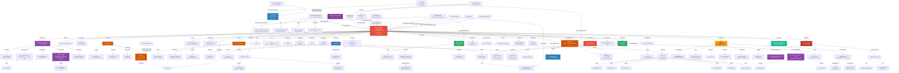

# Knowledge Graph: Antikythera Mechanism

> Source: [Antikythera mechanism - Wikipedia](https://en.wikipedia.org/wiki/Antikythera_mechanism)

---

## Relationship Graph

```mermaid
graph TD
    AM["<b>ANTIKYTHERA MECHANISM</b><br/>Ancient Greek Analogue Computer<br/>c. 205 – 60 BCE"]

    %% ===== DISCOVERY & SHIPWRECK =====
    AM -->|"discovered in"| WRECK["<b>Antikythera Shipwreck</b><br/>c. 70-60 BCE"]
    WRECK -->|"located at"| GLYPHADIA["Point Glyphadia<br/>Antikythera Island"]
    GLYPHADIA -->|"depth"| DEPTH["45 m / 148 ft"]
    WRECK -->|"discovered by"| KONTOS["Capt. Dimitrios Kontos<br/>& Sponge Divers from Symi<br/>1900"]
    WRECK -->|"recovered by"| NAVY["Hellenic Royal Navy<br/>1900-1901"]
    WRECK -->|"also carried"| CARGO["<b>Luxury Cargo</b><br/>Bronze & Marble Statues<br/>Pottery, Glassware, Jewellery"]
    CARGO -->|"includes"| YOUTH["Youth of Antikythera<br/>c. 340 BCE"]
    WRECK -->|"revisited by"| COUSTEAU["Jacques Cousteau<br/>1970s · found coins"]

    %% ===== PHYSICAL STRUCTURE =====
    AM -->|"made of"| BRONZE["Bronze Gears & Plates"]
    AM -->|"enclosed in"| CASE["Wooden Case<br/>34 × 18 × 9 cm"]
    AM -->|"survives as"| FRAGS["<b>82 Fragments</b>"]
    FRAGS -->|"largest"| FRAGA["Fragment A<br/>27 of 30 surviving gears"]
    FRAGS -->|"with gears"| FRAGBCD["Fragments B, C, D<br/>1 gear each"]
    FRAGS -->|"found 2005"| FRAGF["Fragment F<br/>(in storage)"]
    FRAGS -->|"Fragment D"| FRAGD["Fragment D<br/>epicyclic system<br/>63-tooth gear r1"]
    FRAGD -.->|"may model"| JUPITER["♃ Jupiter"]
    AM -->|"contains"| GEARS["<b>~37 Bronze Gears</b>"]
    GEARS -->|"largest"| GEAR223["13 cm diameter<br/>223 teeth · gear b1"]
    GEARS -->|"tooth form"| TEETH["Equilateral Triangles<br/>1.6 mm pitch · hand-cut"]
    AM -->|"bears"| INSCRIP["Greek Inscriptions<br/>~3,000 of ~15,000 chars"]
    INSCRIP -->|"includes"| PARAPEGMA["Parapegma<br/>star almanac on front"]
    AM -->|"operated by"| CRANK["Hand Crank (lost)<br/>→ Crown Gear → b1"]

    %% ===== FRONT FACE =====
    AM -->|"front face"| FRONT["<b>Front Face</b>"]
    FRONT -->|"inner ring"| ZODIAC["Zodiac Dial<br/>12 signs × 30°"]
    FRONT -->|"outer ring"| EGYPCAL["Egyptian Calendar Ring<br/>12 months + 5 days"]
    EGYPCAL -.->|"354-hole debate"| LUNARCAL["Lunar Calendar?<br/>Budiselic et al. 2020"]
    FRONT -->|"pointer"| SUNPTR["Sun Pointer<br/>(mean Sun position)"]
    FRONT -->|"pointer"| MOONPTR["Moon Pointer<br/>+ Phase Display"]
    MOONPTR -->|"uses"| DIFFGEAR["Differential Gear<br/>half-white/half-black ball"]
    FRONT -->|"may have shown"| PLANPTR["5 Planet Pointers<br/>(mostly lost)"]

    %% ===== BACK FACE — UPPER =====
    AM -->|"upper back"| METDIAL["<b>Metonic Dial</b><br/>5-turn spiral"]
    METDIAL -->|"tracks"| METCYC["Metonic Cycle<br/>235 months = 19 years"]
    METDIAL -->|"subsidiary"| GAMESDIAL["Games Dial<br/>4-year cycle<br/>(anticlockwise)"]
    GAMESDIAL -->|"tracks"| OLYMPICS["Olympic Games"]
    GAMESDIAL -->|"tracks"| PYTHIAN["Pythian Games"]
    GAMESDIAL -->|"tracks"| ISTHMIAN["Isthmian Games"]
    GAMESDIAL -->|"tracks"| NEMEAN["Nemean Games"]
    GAMESDIAL -->|"tracks"| NAA["Naa (Dodona)"]
    GAMESDIAL -->|"tracks"| HALIEIA["Halieia of Rhodes"]
    METDIAL -->|"subsidiary"| CALLDIAL["Callippic Dial<br/>76 yrs = 4 Metonic"]

    %% ===== BACK FACE — LOWER =====
    AM -->|"lower back"| SARDIAL["<b>Saros Dial</b><br/>4-turn spiral"]
    SARDIAL -->|"tracks"| SARCYC["Saros Cycle<br/>223 months ≈ 18.2 yrs"]
    SARCYC -->|"predicts"| SOLECLIP["Solar Eclipses"]
    SARCYC -->|"predicts"| LUNECLIP["Lunar Eclipses"]
    SARDIAL -->|"displays"| ECLGLYPH["Eclipse Glyphs<br/>38 lunar + 27 solar<br/>type · time · hour"]
    SARDIAL -->|"subsidiary"| EXELDIAL["Exeligmos Dial<br/>3 Saros = 54 yrs<br/>19,756 days"]

    %% ===== GEAR MECHANICS =====
    GEARS -->|"features"| EPICYCLIC["Epicyclic Gearing"]
    GEARS -->|"features"| PINSLOT["Pin-and-Slot Device"]
    PINSLOT -->|"models"| LUNANOM["Lunar Anomaly<br/>perigee ↔ apogee"]
    PINSLOT -->|"encodes"| MOONPREC["Moon Precession<br/>8.88-year cycle"]

    %% ===== CELESTIAL BODIES TRACKED =====
    AM -->|"tracks"| SUN["☉ Sun"]
    AM -->|"tracks"| MOON["☽ Moon<br/>position + phase + anomaly"]
    AM -->|"inscriptions"| MERCURY["☿ Mercury"]
    AM -->|"inscriptions"| VENUS["♀ Venus<br/>synodic 462"]
    AM -->|"inscriptions"| MARS["♂ Mars"]
    AM -->|"inscriptions"| JUPITER
    AM -->|"inscriptions"| SATURN["♄ Saturn<br/>synodic 442"]

    %% ===== INTELLECTUAL ORIGINS =====
    BABYLON["<b>Babylonian Astronomy</b><br/>arithmetic prediction"] -->|"contributed cycles"| AM
    ARCHIMEDES["<b>Archimedes</b><br/>~287-212 BCE<br/>Syracuse"] -.->|"sphaerae ancestor"| AM
    ARCHIMEDES -->|"devices brought to Rome by"| MARCELLUS["Marcus Claudius Marcellus<br/>Siege of Syracuse 212 BCE"]
    HIPPARCHUS["<b>Hipparchus</b><br/>Rhodes ~190-120 BCE"] -->|"lunar motion theory"| AM
    POSIDONIUS["<b>Posidonius</b><br/>c. 135-51 BCE<br/>School on Rhodes"] -.->|"workshop tradition"| AM
    CICERO["<b>Cicero</b><br/>106-43 BCE<br/>De re publica"] -->|"wrote about sphaerae"| ARCHIMEDES
    CICERO -->|"wrote about sphaerae"| POSIDONIUS
    PAPPUS["Pappus of Alexandria<br/>c. 290-350 AD"] -->|"mentions Archimedes'<br/>On Sphere-Making"| ARCHIMEDES

    %% ===== ORIGIN THEORIES =====
    AM -->|"probable origin"| RHODES["<b>Rhodes</b><br/>astronomy & engineering hub"]
    RHODES -->|"home of"| HIPPARCHUS
    RHODES -->|"home of"| POSIDONIUS
    AM -.->|"alt. origin"| PERGAMON["Pergamon<br/>(coin evidence from Cousteau)"]
    AM -.->|"calendar from"| CORINTH["Corinth / NW Greece"]
    CORINTH -->|"colony"| SYRACUSE["Syracuse<br/>home of Archimedes"]
    AM -.->|"modified for"| EPIRUS["Epirus<br/>(Iversen 2017)"]

    %% ===== DATING =====
    AM -->|"main estimate"| DATE150["150 – 100 BCE"]
    AM -.->|"alt. date"| DATE205["205 BCE (Saros epoch)"]
    AM -.->|"calibration"| DATE178["23 Dec 178 BCE<br/>(2022 proposal)"]
    AM -.->|"calibration"| DATE204["204 BCE<br/>(alternative)"]

    %% ===== MODERN RESEARCHERS =====
    STAIS["<b>Valerios Stais</b><br/>Museum Director"] -->|"recognised gears<br/>17 May 1902"| AM
    SPYRIDON["Spyridon Stais<br/>Politician"] -->|"noticed gear 1902"| AM
    STAIS -->|"cousin of"| SPYRIDON
    REHM["<b>Albert Rehm</b><br/>German Philologist"] -->|"first proposed<br/>astronomical calculator"| AM
    PRICE["<b>Derek de Solla Price</b><br/>Yale · Science Historian"] -->|"studied 1951-1974"| AM
    PRICE -->|"with"| KARAKALOS["Charalampos Karakalos<br/>Nuclear Physicist"]
    PRICE -->|"used"| XRAY["X-ray & Gamma-ray<br/>Imaging 1971"]
    PRICE -->|"published"| GFTG["Gears from the Greeks<br/>1974"]
    WRIGHT["<b>Michael Wright</b><br/>Science Museum London"] -->|"first working model 2002"| AM
    WRIGHT -->|"discovered"| PINSLOT
    WRIGHT -->|"discovered spiral dials"| METDIAL
    WRIGHT -->|"demonstrated"| DIFFGEAR
    MOUSSAS["Xenophon Moussas"] -->|"identified Jupiter gear<br/>in Fragment D"| FRAGD

    %% ===== AMRP =====
    AM -->|"studied by"| AMRP["<b>AMRP</b><br/>Research Project"]
    AMRP -->|"co-founded by"| FREETH["<b>Tony Freeth</b><br/>Mathematician / Filmmaker"]
    AMRP -->|"co-founded by"| EDMUNDS["<b>Mike Edmunds</b><br/>Cardiff · Astrophysicist"]
    AMRP -->|"used"| CTSCAN["450 kV CT Scanner<br/>Roger Hadland 2005"]
    AMRP -->|"published"| NATURE06["Nature 2006"]
    AMRP -->|"revealed"| HIDDEN["Hidden Inscriptions<br/>CT + PTM"]
    AMRP -->|"found 2016"| SYNODIC["Synodic numbers<br/>Venus 462 · Saturn 442"]
    FREETH -->|"published 2021"| UCL["UCL Full<br/>Reconstruction"]
    FREETH -->|"documentary"| DOC["The World's First<br/>Computer · 2012"]

    %% ===== OTHER RESEARCHERS =====
    JONES["Alexander Jones"] -->|"inscriptions & dating"| AM
    EVANS["James Evans"] -->|"eclipse dating 205 BCE"| AM
    CARMAN["Christián Carman 2014"] -->|"eclipse dating"| AM

    %% ===== CURRENT HOME =====
    AM -->|"housed at"| MUSEUM["<b>National Archaeological<br/>Museum · Athens</b>"]
    MUSEUM -->|"displays"| REPLICAS["Reconstructions<br/>& Replicas"]

    %% ===== LEGACY & TECHNOLOGY TRANSMISSION =====
    AM -->|"represents"| LOSTTECH["Lost Technology<br/>~1,000-year gap"]
    LOSTTECH -->|"partial transmission"| BYZANTINE["Byzantine Geared Calendar<br/>5th-6th century"]
    LOSTTECH -->|"partial transmission"| ISLAMIC["Islamic Mechanical Tradition<br/>Banū Mūsā · al-Bīrūnī"]
    LOSTTECH -->|"not matched until"| MEDIEVAL["14th-Century Clocks"]
    MEDIEVAL -->|"e.g."| WALLINGFORD["Richard of Wallingford"]
    MEDIEVAL -->|"e.g."| DONDI["Giovanni de' Dondi<br/>Astrarium"]
    AM -->|"classified as"| FIRSTCOMP["First Known<br/>Analogue Computer"]
    AM -->|"classified as"| ORRERY["Ancient Hand-powered<br/>Orrery"]

    %% ===== STYLES =====
    style AM fill:#e74c3c,stroke:#c0392b,stroke-width:4px,color:#fff
    style WRECK fill:#8e44ad,stroke:#6c3483,stroke-width:3px,color:#fff
    style FRONT fill:#2980b9,stroke:#1f618d,stroke-width:2px,color:#fff
    style METDIAL fill:#27ae60,stroke:#1e8449,stroke-width:2px,color:#fff
    style SARDIAL fill:#27ae60,stroke:#1e8449,stroke-width:2px,color:#fff
    style GEARS fill:#d35400,stroke:#a04000,stroke-width:2px,color:#fff
    style AMRP fill:#f39c12,stroke:#d68910,stroke-width:3px,color:#000
    style MUSEUM fill:#1abc9c,stroke:#148f77,stroke-width:2px,color:#fff
    style FIRSTCOMP fill:#e74c3c,stroke:#c0392b,stroke-width:2px,color:#fff
    style HIPPARCHUS fill:#2980b9,stroke:#1f618d,stroke-width:2px,color:#fff
    style ARCHIMEDES fill:#2980b9,stroke:#1f618d,stroke-width:2px,color:#fff
    style RHODES fill:#d35400,stroke:#a04000,stroke-width:2px,color:#fff
    style BABYLON fill:#7d3c98,stroke:#6c3483,stroke-width:2px,color:#fff
    style FRAGS fill:#d35400,stroke:#a04000,stroke-width:2px,color:#fff
    style CARGO fill:#8e44ad,stroke:#6c3483,stroke-width:2px,color:#fff
    style LOSTTECH fill:#c0392b,stroke:#922b21,stroke-width:2px,color:#fff
    style BYZANTINE fill:#8e44ad,stroke:#6c3483,stroke-width:2px,color:#fff
    style ISLAMIC fill:#8e44ad,stroke:#6c3483,stroke-width:2px,color:#fff
    style FRAGD fill:#d35400,stroke:#a04000,stroke-width:2px,color:#fff
```
