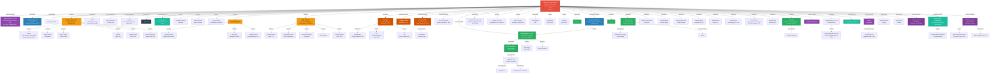

# Knowledge Graph: Yamaha Corporation

> Source: [Yamaha Corporation - Wikipedia](https://en.wikipedia.org/wiki/Yamaha_Corporation)

---

## Relationship Graph

```mermaid
graph TD
    YAMAHA["<b>YAMAHA CORPORATION</b><br/>Japanese Multinational<br/>Musical Instruments & Audio<br/>Est. 1887"]

    %% ===== FOUNDING & HISTORY =====
    YAMAHA -->|"originally named"| NIPPON["<b>Nippon Gakki Co., Ltd.</b><br/>Japan Musical Instrument Mfg.<br/>Est. 1887, renamed 1987"]
    YAMAHA -->|"founded by"| TORAKUSU["<b>Torakusu Yamaha</b><br/>Founder<br/>Built first reed organ 1887"]
    YAMAHA -->|"incorporated"| INCORP["12 October 1897"]
    YAMAHA -->|"post-war president"| KAWAKAMI["<b>Genichi Kawakami</b><br/>Repurposed war machinery<br/>to motorcycles"]
    YAMAHA -->|"renamed in"| RENAME["1987<br/>100th Anniversary<br/>Named after founder"]
    YAMAHA -->|"logo symbolizes"| LOGO["Three Interlocking<br/>Tuning Forks"]
    YAMAHA -->|"corporate mission"| KANDO["<b>Kando</b><br/>Profound excitement &<br/>gratification"]
    YAMAHA -->|"constituent of"| NIKKEI["Nikkei 225"]

    %% ===== HEADQUARTERS & FACTORIES =====
    YAMAHA -->|"headquartered in"| HAMAMATSU["<b>Hamamatsu</b><br/>Shizuoka Prefecture<br/>Japan"]
    YAMAHA -->|"factory"| KAKEGAWA["Kakegawa Factory<br/>Shizuoka"]
    YAMAHA -->|"factory"| TOYOOKA["Toyooka Factory<br/>Iwata, Shizuoka"]
    YAMAHA -->|"factory"| TENRYU["Tenryu Factory<br/>Hamamatsu, Shizuoka"]

    %% ===== BUSINESS SEGMENTS =====
    YAMAHA -->|"segment"| MUSICAL["<b>Musical Instruments</b><br/>World's Largest Manufacturer"]
    YAMAHA -->|"segment"| AUDIO["<b>Audio Equipment</b>"]
    YAMAHA -->|"segment"| IMC["<b>IMC & Others</b><br/>Industrial Machinery<br/>Components, Golf, Resort"]

    MUSICAL -->|"includes"| PIANOS["Pianos<br/>First Japanese piano 1900<br/>First grand piano 1902"]
    MUSICAL -->|"includes"| DIGITAL["Digital Musical<br/>Instruments"]
    MUSICAL -->|"includes"| WINDS["Winds, Strings<br/>& Percussion"]
    MUSICAL -->|"includes"| GUITARS["Guitars<br/>Since 1942"]
    MUSICAL -->|"includes"| DRUMS["Yamaha Drums<br/>Since 1967"]
    MUSICAL -->|"includes"| BAND["Band Instruments<br/>Trumpet first, 1965"]

    AUDIO -->|"includes"| CONSUMER["Consumer Audio<br/>Yamaha Home Audio"]
    AUDIO -->|"includes"| B2B["B2B Audio<br/>Yamaha Pro Audio"]
    AUDIO -->|"includes"| UNIFIED["Yamaha Unified<br/>Communications, Inc."]

    IMC -->|"includes"| SEMICONDUCT["Semiconductors<br/>Since 1971"]
    IMC -->|"includes"| AUTOWOOD["Automobile Interior<br/>Wood Components"]
    IMC -->|"includes"| FA["Factory Automation<br/>Equipment"]
    IMC -->|"includes"| GOLF["Golf Products"]
    IMC -->|"includes"| METALS["Specialty Metals<br/>Since 1961"]

    %% ===== KEY PRODUCTS & MILESTONES =====
    YAMAHA -->|"landmark product"| CS80["<b>Yamaha CS-80</b><br/>Synthesizer, 1977"]
    YAMAHA -->|"landmark product"| DX7["<b>Yamaha DX7</b><br/>First successful<br/>digital synthesizer, 1983"]
    YAMAHA -->|"landmark product"| CDRECORDER["First CD Recorder<br/>Shipped worldwide, 1988"]
    YAMAHA -->|"launched"| VOCALOID["<b>Vocaloid</b><br/>Singing Synthesizer<br/>Announced 2003"]
    YAMAHA -->|"product line"| PSS["PSS & PSR Keyboards<br/>Portable, battery-operated<br/>Late 1990s"]
    YAMAHA -->|"product"| YPG625["Yamaha YPG-625<br/>Keyboard of the Year 2007"]
    YAMAHA -->|"product"| SHS10["SHS-10 Keytar<br/>Consumer MIDI keytar"]
    YAMAHA -->|"first product"| REEDORGAN["Reed Organs<br/>1887"]
    YAMAHA -->|"product"| HARMONICA["Harmonicas<br/>Since 1914"]
    YAMAHA -->|"product"| FURNITURE["Furniture<br/>Since 1903"]

    VOCALOID -->|"exhibited at"| MUSIKMESSE["Musikmesse<br/>Germany, March 2003"]
    VOCALOID -->|"product"| VY1["VY1<br/>Professional series<br/>Sept 2010"]
    VOCALOID -->|"product"| LILY["Lily<br/>Sold via Internet Co."]
    VOCALOID -->|"mobile version"| VOCIPHONE["Vocaloid for<br/>iPhone & iPad"]

    %% ===== MOTOR COMPANY SPIN-OFF =====
    YAMAHA -->|"spun off in 1955"| MOTOR["<b>Yamaha Motor Co., Ltd.</b><br/>Independent Company<br/>Motorcycles & Marine"]
    KAWAKAMI -->|"initiated"| MOTOR
    MOTOR -->|"first product"| YA1["<b>YA-1 'Akatombo'</b><br/>Red Dragonfly<br/>125cc, 1954"]
    YA1 -->|"patterned after"| DKW["DKW RT 125<br/>German motorcycle"]
    DKW -->|"also copied by"| BSA["BSA Bantam"]
    DKW -->|"also copied by"| HARLEY["Harley-Davidson Hummer"]
    MOTOR -->|"products"| MOTORCYCLES["Motorcycles<br/>Since 1955"]
    MOTOR -->|"products"| MARINE["Marine Products"]

    %% ===== SUBSIDIARIES =====
    YAMAHA -->|"subsidiary"| AMPEG["Ampeg"]
    YAMAHA -->|"subsidiary"| BOSENDORFER["<b>L. Bosendorfer</b><br/>Klavierfabrik GmbH<br/>Acquired Jan 2008"]
    YAMAHA -->|"subsidiary"| LINE6["Line 6"]
    YAMAHA -->|"subsidiary"| STEINBERG["<b>Steinberg</b><br/>Media Technologies GmbH<br/>Acquired Jan 2005"]
    YAMAHA -->|"subsidiary"| YAMCORP_US["Yamaha Corporation<br/>of America"]
    YAMAHA -->|"subsidiary"| YAMMUSIC_EU["Yamaha Music<br/>Europe GmbH"]
    YAMAHA -->|"subsidiary"| YAMMUSIC_ASIA["Yamaha Music Asia<br/>Private Limited"]
    YAMAHA -->|"subsidiary"| YAMMUSIC_AU["Yamaha Music<br/>Australia Pty. Ltd."]
    YAMAHA -->|"subsidiary"| YAMGUITAR["Yamaha Guitar<br/>Group, Inc."]
    YAMAHA -->|"subsidiary"| YAMFINE["Yamaha Fine<br/>Technologies Co., Ltd."]
    YAMAHA -->|"subsidiary"| YAMCOMM["Yamaha Music<br/>Communications Co., Ltd.<br/>Record company, 2000"]
    YAMAHA -->|"subsidiary"| YAMARTIST["Yamaha Artist<br/>Services, Inc."]
    YAMAHA -->|"subsidiary"| YAMUK["Yamaha Music U.K. Ltd<br/>Renamed 2007"]

    BOSENDORFER -->|"acquired from"| BAWAG["BAWAG PSK Gruppe<br/>Austrian Bank"]
    BOSENDORFER -->|"continues mfg. in"| AUSTRIA["Austria"]
    STEINBERG -->|"acquired from"| PINNACLE["Pinnacle Systems"]
    YAMUK -->|"formerly"| KEMBLE["Yamaha-Kemble Music UK<br/>Kemble family bought out 2007"]

    %% ===== ACQUISITIONS & PARTNERSHIPS =====
    YAMAHA -->|"acquired 1988"| SEQUENTIAL["<b>Sequential Circuits</b>"]
    YAMAHA -->|"51% stake 1987"| KORG["<b>Korg</b><br/>Competitor"]
    KORG -->|"bought back stake"| KORG_BUYBACK["Korg bought out<br/>Yamaha's stake, 1993"]

    %% ===== MUSIC EDUCATION =====
    YAMAHA -->|"founded 1954"| MUSICSCHOOL["<b>Yamaha Music School</b>"]
    YAMAHA -->|"established 1966"| FOUNDATION["<b>Yamaha Music Foundation</b><br/>Authorized by Ministry<br/>of Education"]
    FOUNDATION -->|"purpose"| EDUCATE["Promote Music Education<br/>& Popularization"]

    %% ===== SPORTS =====
    YAMAHA -->|"sports team"| JUBILO["Yamaha Jubilo<br/>Rugby"]
    YAMAHA -->|"sports team"| IWATA["Jubilo Iwata<br/>Football"]

    %% ===== ARCHERY (CLOSED) =====
    YAMAHA -->|"former business"| ARCHERY["Archery Products<br/>1959-2002<br/>6 Olympic Gold Medals"]

    %% ===== LIVINGTEC SPIN-OFF =====
    YAMAHA -->|"former subsidiary"| YLT["YAMAHA Livingtec<br/>Spun off 1991<br/>Unit baths, kitchens"]
    YLT -->|"sold to"| JIP["Japan Industrial Partners<br/>& Foreign Funds, 2010"]
    YLT -->|"withdrew via"| MBO["MBO, renamed Oct 2013"]

    %% ===== STYLES =====
    style YAMAHA fill:#e74c3c,stroke:#c0392b,stroke-width:4px,color:#fff
    style NIPPON fill:#8e44ad,stroke:#6c3483,stroke-width:3px,color:#fff
    style TORAKUSU fill:#2980b9,stroke:#1f618d,stroke-width:2px,color:#fff
    style KAWAKAMI fill:#2980b9,stroke:#1f618d,stroke-width:2px,color:#fff
    style MOTOR fill:#27ae60,stroke:#1e8449,stroke-width:3px,color:#fff
    style MUSICAL fill:#f39c12,stroke:#d68910,stroke-width:3px,color:#000
    style AUDIO fill:#f39c12,stroke:#d68910,stroke-width:3px,color:#000
    style IMC fill:#f39c12,stroke:#d68910,stroke-width:3px,color:#000
    style HAMAMATSU fill:#1abc9c,stroke:#148f77,stroke-width:2px,color:#fff
    style DX7 fill:#d35400,stroke:#a04000,stroke-width:2px,color:#fff
    style CS80 fill:#d35400,stroke:#a04000,stroke-width:2px,color:#fff
    style VOCALOID fill:#d35400,stroke:#a04000,stroke-width:2px,color:#fff
    style BOSENDORFER fill:#27ae60,stroke:#1e8449,stroke-width:2px,color:#fff
    style STEINBERG fill:#27ae60,stroke:#1e8449,stroke-width:2px,color:#fff
    style LINE6 fill:#27ae60,stroke:#1e8449,stroke-width:2px,color:#fff
    style AMPEG fill:#27ae60,stroke:#1e8449,stroke-width:2px,color:#fff
    style SEQUENTIAL fill:#8e44ad,stroke:#6c3483,stroke-width:2px,color:#fff
    style KORG fill:#8e44ad,stroke:#6c3483,stroke-width:2px,color:#fff
    style FOUNDATION fill:#1abc9c,stroke:#148f77,stroke-width:2px,color:#fff
    style MUSICSCHOOL fill:#1abc9c,stroke:#148f77,stroke-width:2px,color:#fff
    style YA1 fill:#27ae60,stroke:#1e8449,stroke-width:2px,color:#fff
    style ARCHERY fill:#7d3c98,stroke:#6c3483,stroke-width:2px,color:#fff
    style YLT fill:#7d3c98,stroke:#6c3483,stroke-width:2px,color:#fff
    style NIKKEI fill:#2c3e50,stroke:#1a252f,stroke-width:2px,color:#fff
```
